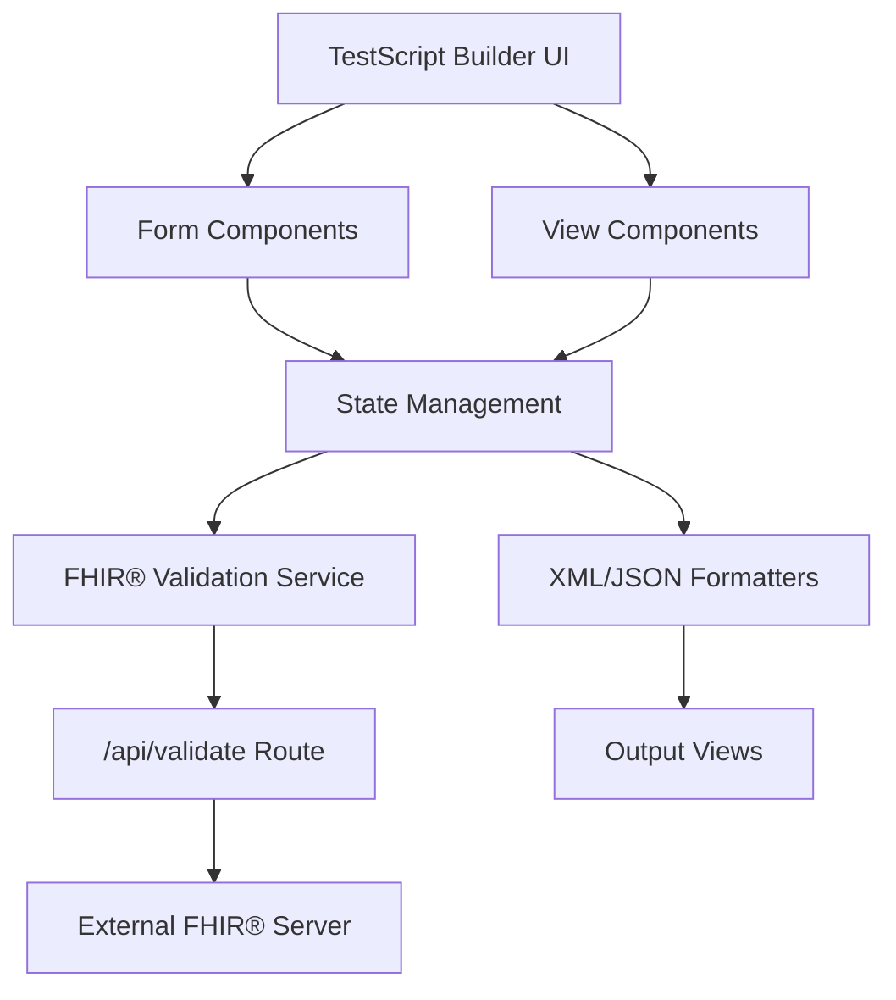
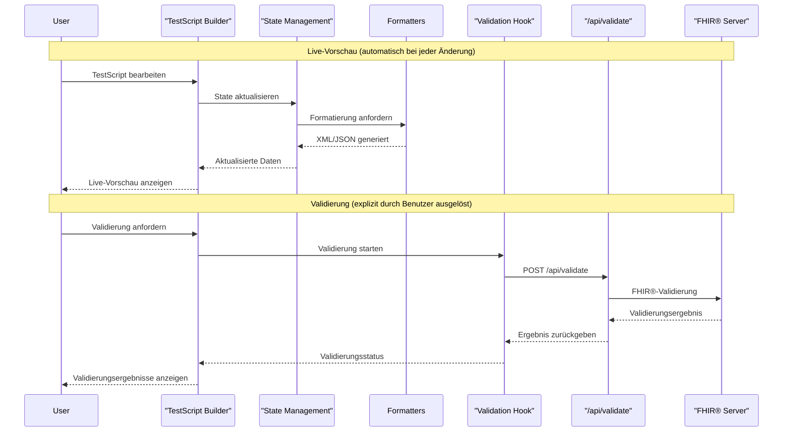
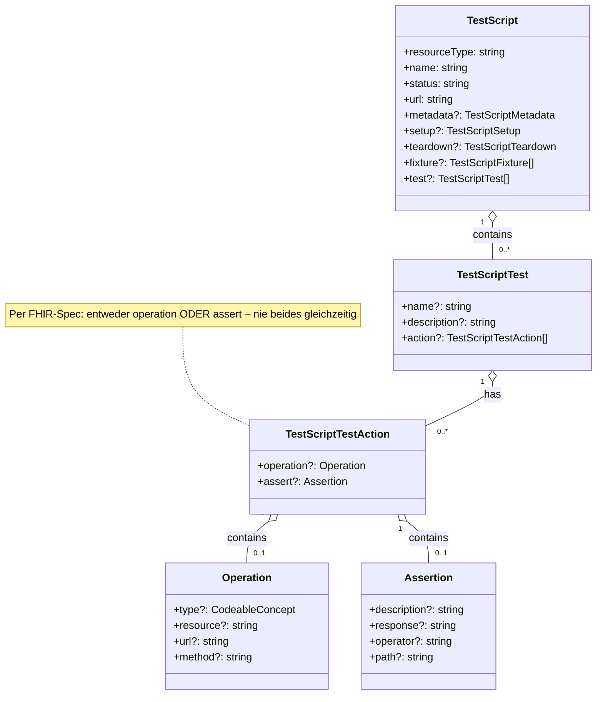

# TestFhiry TinkerTool

Ein modernes Web-Tool zur visuellen Erstellung und Verwaltung von FHIR® TestScript-Ressourcen. Ermöglicht die Erstellung komplexer TestScripts ohne manuelle XML/JSON-Bearbeitung.
Dies ist ein Teil eines übergestellten Studienprojekts, der zweite Teil ist das Projekt [TestFhiry-TestRunner](https://github.com/HL7Austria/HL7-AT-TestFhiry-TestRunner).

## Inhaltsverzeichnis

- [Einleitung](#einleitung)
- [Kernfunktionen](#kernfunktionen)
- [Verzeichnisstruktur](#verzeichnisstruktur)
- [Funktionalitäten](#funktionalitäten)
- [Architekturüberblick](#architekturüberblick)
- [Codebase Overview](#codebase-overview)
- [Setup & Installation](#setup--installation)
- [Konfiguration](#konfiguration)
- [Ausführen](#ausführen)
- [Deployment](#deployment)
- [Troubleshooting](#troubleshooting)
- [Limitierungen](#limitierungen)
- [Roadmap](#roadmap)
- [Externe Quellen](#externe-quellen)

## Einleitung

### Zielsetzung
TinkerTool vereinfacht die Erstellung von FHIR® TestScripts durch eine intuitive, visuelle Benutzeroberfläche. Das Tool ermöglicht es Entwicklern, TestScripts ohne tiefe FHIR®-Kenntnisse zu erstellen.

### Aktuelle Funktionalität
- TestScript-Erstellung mit visuellen Formularen
- Echtzeit-Validierung gegen FHIR® R5 Standards
- Export in XML und JSON Format

## Kernfunktionen

- **Visueller TestScript Builder** - Formular-basierte Erstellung von FHIR® TestScripts
- **Live-Vorschau** - Echtzeit-Anzeige in XML, JSON und strukturierter Form
- **FHIR® R4/R5 Unterstützung** - Version-spezifische Features (z.B. Scope nur in R5)
- **FHIR® R5 Validierung** - Integration mit FHIR®-Servern für automatische Validierung
- **Modulare Architektur** - Saubere Trennung von UI, Logik und Services
- **Type-Safety** - Vollständige TypeScript-Unterstützung mit FHIR®-Typen
- **Common Actions (Custom Feature)** - Wiederverwendbare Actions mit Parametern (nicht im FHIR®-Standard)

## Verzeichnisstruktur

```
.
├─ app/                          # Next.js App Router
│  ├─ api/validate/              # FHIR®-Validierungs-API
│  ├─ globals.css               # Globale Styles
│  ├─ layout.tsx                # Root Layout
│  └─ page.tsx                   # Hauptseite
├─ components/                   # React-Komponenten
│  ├─ form-builder/             # Formular-Builder Module
│  │  ├─ sections/              # Formular-Sektionen
│  │  ├─ shared/                # Wiederverwendbare Komponenten
│  │  └─ form-builder.tsx       # Haupt-Form-Builder
│  ├─ test-script-builder/      # TestScript Builder Module
│  ├─ ui/                       # shadcn/ui Komponenten
│  └─ *.tsx                     # Weitere Komponenten
├─ hooks/                        # Custom React Hooks
│  ├─ use-fhir-validation.ts      # FHIR®-Validierung Hook
│  ├─ use-client-only.ts         # Client-side utilities
│  ├─ use-progress-animation.ts  # Progress animation hook
│  └─ index.ts                   # Hook exports
├─ lib/                         # Utilities und Services
│  ├─ formatters/              # JSON/XML Formatierung
│  ├─ services/                # FHIR®-Validierungs-Service
│  └─ utils.ts                  # Hilfsfunktionen
├─ types/                       # TypeScript-Typen
│  ├─ fhir-config.ts            # FHIR®-Konfigurationstypen
│  ├─ fhir-enhanced.ts          # Erweiterte FHIR®-Typen
│  ├─ fhir-versions/            # Versionsspezifische Typen
│  │  ├─ r4-types.ts
│  │  └─ r5-types.ts
│  └─ ig-types.ts               # Implementation Guide Typen
├─ public/                      # Statische Assets
└─ README.md
```

### Verzeichnis-Zweck

**app/**: Next.js App Router mit Seiten, Layouts und API-Routes. Enthält die Hauptanwendung und FHIR®-Validierungs-Endpoint.

**components/**: Alle React-Komponenten der Anwendung. Form-Builder für TestScript-Erstellung, UI-Komponenten und View-Renderer.

**hooks/**: Custom React Hooks für State-Management und FHIR®-Validierung.

**lib/**: Utility-Funktionen, Services und Formatter. Enthält FHIR®-Validierungslogik und Formatierungstools.

**types/**: TypeScript-Typdefinitionen für TestScripts und Validierung.

## Funktionalitäten

### TestScript Builder
- **Zweck:** Visuelle Erstellung von FHIR® TestScripts über Formulare
- **Eingaben:** Benutzer-Eingaben über Formulare (Name, Status, Actions, Assertions)
- **Ausgaben:** Vollständiges FHIR® TestScript in JSON/XML Format
- **Nebenbedingungen:** FHIR® R5 Konformität, Validierung gegen FHIR®-Server

### Live-Vorschau
- **Zweck:** Echtzeit-Anzeige des generierten TestScripts
- **Eingaben:** Aktueller TestScript-State
- **Ausgaben:** Formatierte Darstellung in XML, JSON und strukturierter Form
- **Nebenbedingungen:** Automatische Aktualisierung bei Änderungen

### FHIR®-Validierung
**Zweck:** Automatische Validierung gegen FHIR® R5 Standards
**Eingaben:** TestScript-Objekt
**Ausgaben:** Validierungsergebnisse mit Fehlern und Warnungen
**Nebenbedingungen:** Verbindung zu FHIR®-Server erforderlich

## Architekturüberblick

Die Anwendung folgt einer modularen Architektur mit klarer Trennung zwischen UI, Geschäftslogik und externen Services. Der Datenfluss erfolgt unidirektional von der UI über State-Management zu Services und zurück.

### Komponentendiagramm



### Sequenzdiagramm



### UML-Klassendiagramm



## Codebase Overview

### app/
**Zweck:** Next.js App Router mit Seiten und API  
**Hauptdateien:** 
- `page.tsx` → Hauptseite mit TestScript Builder
- `layout.tsx` → Root Layout mit Theme Provider
- `api/validate/route.ts` → FHIR®-Validierungs-API

### components/
**Zweck:** Alle UI-Komponenten der Anwendung  
**Hauptdateien:**
- `test-script-builder.tsx` → Haupt-Builder-Komponente
- `form-builder/` → Formular-Komponenten für TestScript-Erstellung
- `structured-view.tsx` → Hierarchische TestScript-Darstellung
- `xml-view.tsx` → XML-Output mit Syntax-Highlighting
- `json-view.tsx` → JSON-Output
- `validation-tab.tsx` → Validierungsergebnisse

### lib/
**Zweck:** Geschäftslogik, Services und Utilities  
**Hauptdateien:**
- `services/cache-service.ts` → Caching-Service
- `services/fixture-generator.ts` → Fixture-Generierung
- `services/ig-config-storage.ts` → Implementation Guide Konfiguration
- `services/ig-service.ts` → Implementation Guide Service
- `formatters/xml-formatter.ts` → XML-Generierung
- `formatters/json-formatter.ts` → JSON-Formatierung
- `initial-data.ts` → Standard-TestScript-Template
- `utils.ts` → Hilfsfunktionen
- `fhir-version-context.tsx` → FHIR®-Version Context

### types/
**Zweck:** TypeScript-Typdefinitionen  
**Hauptdateien:**
- `fhir-config.ts` → FHIR®-Konfigurationstypen
- `fhir-enhanced.ts` → Erweiterte FHIR®-Typen
- `fhir-versions/r4-types.ts` → R4-spezifische Typen
- `fhir-versions/r5-types.ts` → R5-spezifische Typen
- `ig-types.ts` → Implementation Guide Typen

### hooks/
**Zweck:** Custom React Hooks für State-Management  
**Hauptdateien:**
- `use-fhir-validation.ts` → FHIR®-Validierung mit State-Management
- `use-client-only.ts` → Client-seitige Utilities
- `use-progress-animation.ts` → Progress-Animation Hook

## Setup & Installation
### wichtige Abhängigkeiten:
- Next.js 16.1.1 (Framework)
- React 19.2.3 (UI-Library)
- TypeScript 5 (Type-Safety)
- Tailwind CSS 4 (Styling)
- Radix UI (Komponenten)
- xmlbuilder2 (XML-Generierung)

### Voraussetzungen
- Node.js 18 oder höher
- npm oder yarn
- Git

### Installationsschritte

1. **Repository klonen**
   ```bash
   git clone https://github.com/HL7Austria/HL7-AT-TestFhiry-TinkerTool.git
   cd HL7-AT-TestFhiry-TinkerTool
   ```

2. **Abhängigkeiten installieren**
   ```bash
   npm install
   ```

3. **Entwicklungsserver starten**
   ```bash
   npm run dev
   ```

4. **Browser öffnen**
   - Navigiere zu `http://localhost:3000`

### Umgebungsvariablen

Erstelle `.env.local` für lokale Konfiguration:

```bash
# FHIR® Server für Validierung
NEXT_PUBLIC_FHIR_SERVER_URL=https://hapi.fhir.org/baseR5

# Optional: Custom Validierungs-URL
NEXT_PUBLIC_VALIDATION_ENDPOINT=/api/validate
```

## Konfiguration

### Standardwerte
- FHIR® Server: `https://hapi.fhir.org/baseR5`
- Validierungs-Endpoint: `/api/validate`
- Theme: System (automatische Dark/Light Mode Erkennung)

### Überschreibung
Konfiguration erfolgt über Umgebungsvariablen in `.env.local` oder über die Next.js-Konfiguration in `next.config.ts`.

## Ausführen

### Entwicklung
```bash
npm run dev          # Entwicklungsserver mit Turbopack
```

### Produktion
```bash
npm run build        # Produktions-Build
npm run start        # Produktions-Server
```

## Quick Start Tutorial

Dieses Tutorial führt Sie durch die Erstellung Ihres ersten FHIR® TestScripts mit TestFhiry TinkerTool.

### Schritt 1: Installation

1. **Repository klonen**
   ```bash
   git clone https://github.com/HL7Austria/HL7-AT-TestFhiry-TinkerTool.git
   cd HL7-AT-TestFhiry-TinkerTool
   ```

2. **Abhängigkeiten installieren**
   ```bash
   npm install
   ```

3. **Entwicklungsserver starten**
   ```bash
   npm run dev
   ```

4. **Browser öffnen**
   - Navigieren Sie zu `http://localhost:3000`
   - Die Anwendung sollte automatisch im Browser öffnen

### Schritt 2: Erste Schritte mit der Benutzeroberfläche

Nach dem Öffnen der Anwendung sehen Sie:

- **Links**: Navigationsleiste mit Tabs für verschiedene Abschnitte
- **Rechts**: Hauptarbeitsbereich mit dem Form-Builder

### Schritt 3: Ein TestScript erstellen

#### 3.1 Grundinformationen ausfüllen

1. Klicken Sie auf den Tab "Form Builder"
2. Wählen Sie im linken Panel die Sektion "Basic Information"
3. Füllen Sie die Pflichtfelder aus:
   - **Name**: Geben Sie Ihrem TestScript einen Namen (z.B. "Patient Read Test")
   - **Status**: Wählen Sie "active" oder "draft"
   - **URL**: Geben Sie eine eindeutige URL ein (z.B. "http://example.org/TestScript/PatientRead")

#### 3.2 Metadaten konfigurieren

1. Wählen Sie die Sektion "Metadata"
2. Fügen Sie Capabilities hinzu, die Ihr TestScript benötigt
3. Geben Sie Links zu relevanten Spezifikationen oder Dokumentation an

#### 3.3 Test-Systeme definieren

1. Wählen Sie die Sektion "Systems & Endpoints"
2. Definieren Sie die Test-Systeme, die Sie testen möchten
3. Konfigurieren Sie Origin und Destination Mappings

#### 3.4 Fixtures hinzufügen (optional)

1. Wählen Sie die Sektion "Fixtures & Profiles"
2. Fügen Sie vorbereitete Ressourcen hinzu, die in Ihren Tests verwendet werden
3. Referenzieren Sie Profile, die Sie validieren möchten

#### 3.5 Test-Cases erstellen

1. Wählen Sie die Sektion "Test Scenarios"
2. Klicken Sie auf "Add Test Case"
3. Geben Sie dem Test Case einen Namen und eine Beschreibung
4. Fügen Sie Actions und Assertions hinzu:
   - **Operation**: Definieren Sie die FHIR®-Operation (z.B. READ, CREATE, UPDATE)
   - **Assertion**: Validieren Sie die Antwort (z.B. Status-Code, Response-Header, Inhalt)

#### 3.6 Setup und Teardown konfigurieren (optional)

1. **Setup**: Fügen Sie Vorbereitungs-Operationen vor den eigentlichen Tests hinzu
2. **Teardown**: Fügen Sie Bereinigungs-Operationen nach den Tests hinzu

### Schritt 4: TestScript validieren

1. Klicken Sie auf den Tab "Validation"
2. Geben Sie die URL eines FHIR®-Servers ein (z.B. `https://hapi.fhir.org/baseR5`)
3. Klicken Sie auf "Validate Now"
4. Warten Sie auf das Validierungsergebnis
5. Überprüfen Sie:
   - **Fatal Errors**: Kritische Fehler, die behoben werden müssen
   - **Errors**: Fehler, die die Validierung fehlschlagen lassen
   - **Warnings**: Warnungen, die behoben werden sollten
   - **Informationen**: Hinweise zur Verbesserung

### Schritt 5: TestScript exportieren

1. Klicken Sie auf den Tab "JSON View" oder "XML View"
2. Überprüfen Sie den generierten Code
3. Klicken Sie auf "Copy to Clipboard" oder "Download" um das TestScript zu exportieren

### Schritt 6: TestScript importieren (optional)

1. Klicken Sie auf "Import TestScript"
2. Wählen Sie eine vorhandene XML oder JSON Datei
3. Das TestScript wird automatisch geladen und kann bearbeitet werden

### Tipps für Einsteiger

- **Starten Sie einfach**: Beginnen Sie mit einem einfachen READ-Operation Test
- **Validieren Sie oft**: Validieren Sie regelmäßig während der Entwicklung
- **Nutzen Sie die Vorschau**: Die Live-Vorschau hilft Ihnen, die Struktur zu verstehen
- **Verwenden Sie Templates**: Erstellen Sie Templates für häufige Test-Szenarien
- **Lesen Sie die Fehlermeldungen**: Die Validierung gibt detaillierte Hinweise zur Fehlerbehebung

### Häufige Probleme und Lösungen

**Problem**: Validierung schlägt fehl mit "Connection Error"
- **Lösung**: Überprüfen Sie die FHIR®-Server-URL und Ihre Internetverbindung

**Problem**: TestScript wird nicht korrekt generiert
- **Lösung**: Stellen Sie sicher, dass alle Pflichtfelder ausgefüllt sind

**Problem**: Assertion schlägt fehl
- **Lösung**: Überprüfen Sie den Pfad und die Operator-Konfiguration

### Nächste Schritte

Nachdem Sie Ihr erstes TestScript erstellt haben, können Sie:
- Komplexere Test-Szenarien erstellen
- Variablen für dynamische Tests verwenden
- Implementation Guides konfigurieren
- TestScripts für verschiedene FHIR®-Versionen erstellen

## Deployment

### Vercel (Empfohlen)
```bash
npm i -g vercel
vercel --prod
```

### Andere Plattformen
- Netlify: Automatisches Deployment über Git
- Docker: Container-basierte Deployment
- Traditionelle Hosting-Provider: Statische Builds

### Health-Checks
- `/api/validate` Endpoint für Validierung
- Automatische FHIR®-Server-Verbindungstests

## Troubleshooting

### Häufige Fehler

**"Module not found" Fehler:**
- `npm install` erneut ausführen
- Node.js Version prüfen (18+ erforderlich)

**FHIR®-Validierung schlägt fehl:**
- Internetverbindung prüfen
- FHIR®-Server-URL in Umgebungsvariablen prüfen
- CORS-Einstellungen des FHIR®-Servers prüfen

**Build-Fehler:**
- TypeScript-Fehler in `next.config.ts` deaktiviert
- ESLint-Fehler werden ignoriert
- Bei Problemen: `npm run build` mit Debug-Output

### Logs
- Browser-Konsole für Client-seitige Fehler
- Terminal für Server-seitige Logs
- Network-Tab für API-Anfragen

## Limitierungen
- Große TestScripts (>1MB) können Performance-Probleme verursachen
- Validierung ist abhängig von externen FHIR®-Servern
- Offline-Modus nicht vollständig unterstützt

## Roadmap

### Mögliche Nächste Schritte (Q1 2025)
1. **Erweiterte Assertion-Typen** - Mehr Validierungsoptionen für komplexe Tests
2. **Template-System** - Vorgefertigte TestScript-Templates für häufige Use Cases
3. **Batch-Import** - Import mehrerer TestScripts gleichzeitig
4. **Erweiterte Validierung** - Lokale Validierung ohne externe Server
5. **Export-Optimierungen** - Mehr Ausgabeformate (YAML, CSV)
6. **Performance-Optimierung** - Lazy Loading für große TestScripts
7. **Dokumentation** - Interaktive Tutorials und Beispiele

### Out-of-Scope
- FHIR®-Server-Implementierung
- Test-Ausführung (nur TestScript-Erstellung)
- Multi-User-Kollaboration
- Versionierung von TestScripts

## Projektteam
* Julia Bodingbauer  
* Delaram Darehshoori  
* Magdalena Dorr  
* Alina Haider  
* Michael Bogensberger  
* Laura Ziebermayr

## Externe Quellen
- HL7 FHIR® - Standards und Spezifikationen
- shadcn/ui - UI-Komponenten-Bibliothek
- Next.js Team - React-Framework
- Radix UI - Barrierefreie Komponenten
- Tailwind CSS - Utility-First CSS-Framework

---

